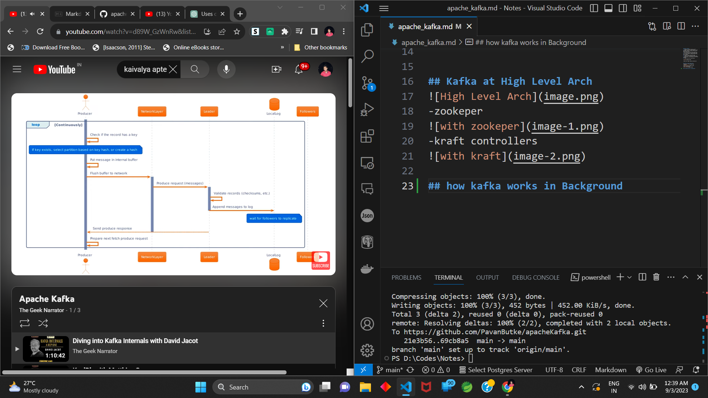

## What's Kafka?
1. Platform includes Kafka Cluster
2. Kafka cluster is like PubSub ; which publishes events and you can consume them various apis
3. Can consist of low level apis which consist of producer and consumer apis
4. a connect api to connect with third party system
5. creates topics and partitions
6. topics are collection of same items
7. partitions is distrubuted to diffrent machines
8. topics are set of partitions

-kafka has leader based architecture

## Kafka at High Level Arch

-zookeper

-kraft controllers

## how kafka works in Background

- producer is collecting reqst to pack a batch
- produces to broker
- log of data is on disk / don't cache on broker
- to match less writes
- 
## why do we need Kafka?
- why would DBs get improved in terms of speed?